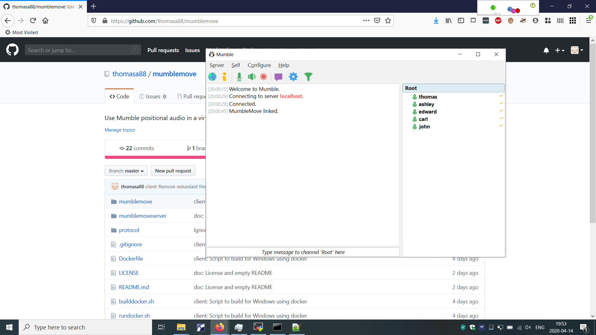
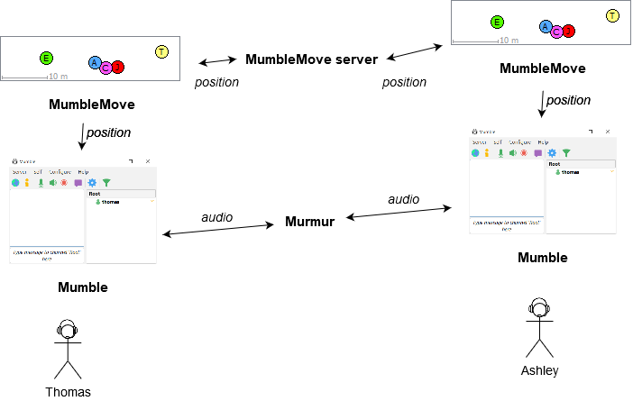
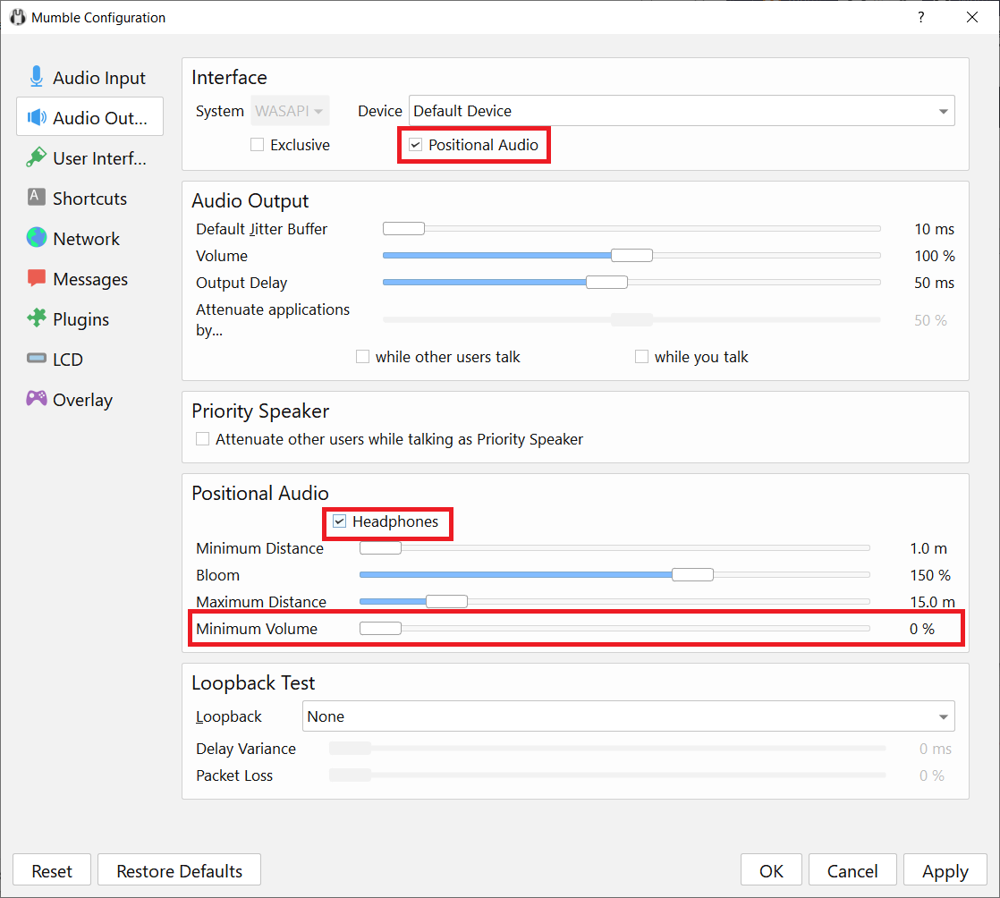
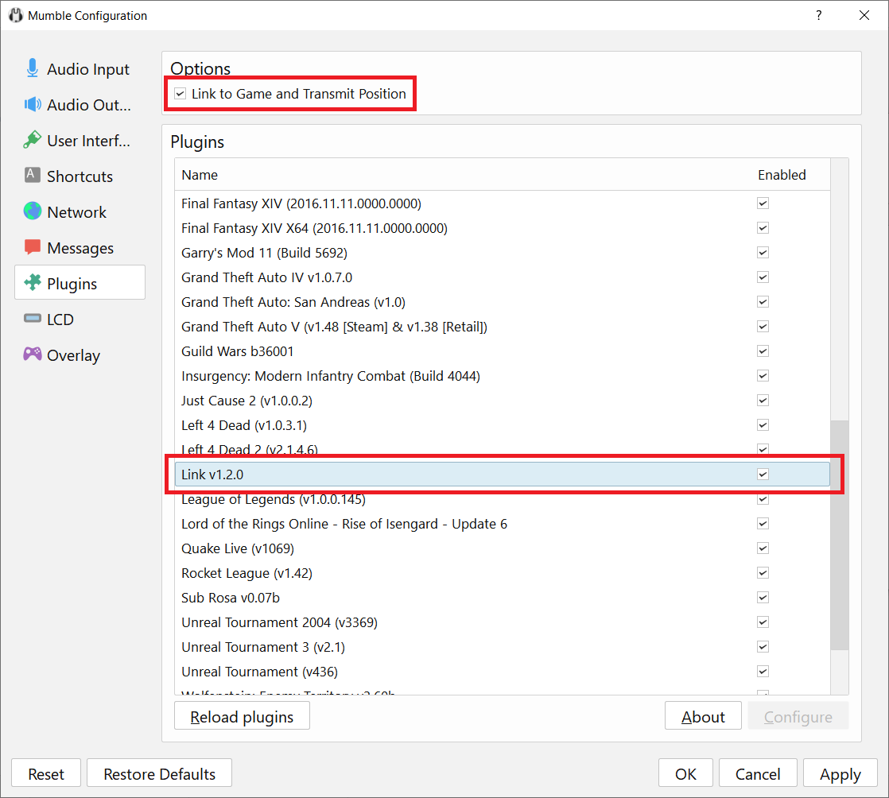
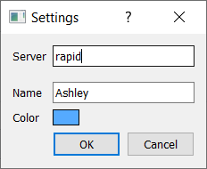
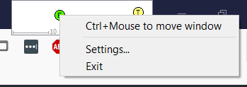

# MumbleMove

MumbleMove uses the positional audio support in [Mumble](https://www.mumble.info/) to create a virtual room. It attempts to recreate the feeling of having a development team together in a room.


Users are represented by colored dots in the virtual room. By using the mouse, they can walk up closer to talk to each other, or just stay a at a distance to hear the buzz in the room. To mimic seeing someone walking up close by, MumbleMove flashes in the color of the approaching user.

MumbleMove works on both Windows and Linux. MumbleMove communicates with the Mumble *Link* plugin, to provide position to Mumble.




## Setup

Each user needs to have both Mumble and MumbleMove running. A server needs to be running Murmur (the Mumble server) and MumbleMove Server, for the users to connect to.

Audio is communicated through Murmur and position is communicated through MumbleMove Server.



## Installation

### Murmur (Mumble server)

Download Murmur from the [Mumble downloads page](https://www.mumble.info/downloads/). For Windows, Murmur is part of the Mumble installer.

Murmur can be installed using APT in Ubuntu:

```
sudo apt install mumble-server
```

### Mumble

Download and install Mumble from the [Mumble downloads page](https://www.mumble.info/downloads/).

Mumble can be installed using APT in Ubuntu:

```
sudo apt install mumble
```

### MumbleMove Server

Download MumbleMove Server from the MumbleMove [release page](https://github.com/thomasa88/mumblemove/releases).

MumbleMove Server depends on Qt Core and Qt Network. The following command can be used in Ubuntu to install the dependencies:

```
sudo apt install libqt5network5 libqt5core5a
```

### MumbleMove

Download MumbleMove Server from the MumbleMove [release page](https://github.com/thomasa88/mumblemove/releases).

MumbleMove Server depends on Qt Core, Qt Network, Qt Gui and Qt Widgets. The following command can be used in Ubuntu to install the dependencies:

```
sudo apt install libqt5widgets5 libqt5gui5 libqt5network5 libqt5core5a
```

## Configuration

### Mumble Audio Configuration

Start Mumble and follow the Audio Wizard. Make sure to check *Enable positional audio* and *Use headphones*.

Then open Configure -> Settings... and configure as follows:






To get rid of the G15 helper window, go to the LCD page and uncheck *Logitech Gamepanel*.

### Connecting to Murmur

Click Server -> Connect... and add the Murmur server. Leave the default port.

### MumbleMove Configuration

Start MumbleMove and enter the address to the MumbleMove server. Also enter your name and select a color.




Right click the MumbleMove window to access the main menu.




The following output is displayed in Mumble when it is connected with MumbleMove.

    [xx:xx:xx] MumbleMove linked.

MumbleMove displays an error if it cannot connect to MumbleMove Server.


The scale indicator relates to the positional audio settings in Mumble.

## Security and Firewalls

Mumblemove has no built-in security, and as such, it should probably not be exposed to the public Internet. Packet parsing relies on Qt serialization. There is no packet rate limit.

Mumblemove Server listens on port 49079 (TCP).

## Developing

MumbleMove is developed on Linux using Qt Creator.

### Building using Qt Creator

The Linux applications can be built using Qt Creator.

### Building in Console

The applications can be built in the console using `build.sh`. 

```
Usage: ./build.sh linux|windows [debug|release]

Files are output in the build directory.
```

Building for Windows requires Mingw-w64. A Docker is containing Mingw-w64 is provided. Docker needs to be installed for this to work.

Build the Docker image using `./builddocker.sh`. `./build.sh` will automatically use the Docker image.

The Docker image can also be manually started using `./rundocker.sh`.

